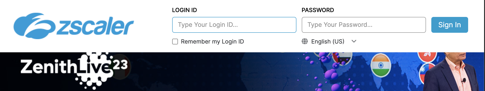

# Polarity Zscaler Integration


Zscaler Internet Access (ZIA) is a cloud-based security solution that provides secure and direct access to the internet for users,
protecting against cyber threats and ensuring compliance with organizational policies. It includes features such as web filtering, threat protection, and secure access service edge (SASE) capabilities.

To learn more about Zscaler, visit the [official website](https://www.zscaler.com/).

The Polarity-Zscaler integration allows users to add or remove URLs from ZScaler URL categories.

## Zscaler Integration Options

### Zscaler API URL

The URL for your Zscaler API instance. The URL should include the scheme (https://). Example values for this are:

```
https://zsapi.zscalerbeta.net
https://zsapi.zscalerone.net
https://zsapi.zscalertwo.net
https://zsapi.zscalerthree.net
https://zsapi.zscaler.net
https://zsapi.zscloud.net
```

### ZScaler Username

Enter the username for your ZScaler account.

### ZScaler Password

Enter the password associated with your ZScaler username.

### Zscaler API Token

Enter the Zscaler API Token associated with your Zscaler account.

### URL Categories

A comma separated list of Zscaler category IDs that URLs can be added to or removed from. The first category in the list will be used as the default category. You can also add a user-friendly label to the category by prepending the category with a label and using a colon to separate it from the category ID (i.e., `<label>:<categoryId>`). Note that the name of the category is not the same as the category's ID. See the integration README for information on finding the category ID. This option must be set to "Users can view only".

### Category Notes:

The category ID is not the same as the category name. In order to configure which categories you want to add or remove URLs from, you must list the category ID. There are a couple ways of doing this.

Option 1:

1. Navigate to the Zscaler Admin Portal and login using our Zscaler credentials.
   
2. Once logged in, on the left-hand side of the zscalar dashboard, hover over the 'Administration' button, a menu will appear, under the 'Resources' section, click on 'URL Categories'.
   
3. A list of all the URL categories will appear. Click on the category you want to add or remove URLs from, and the ID will pop up. Copy the ID and paste it into the 'URL Categories' option in the integration configuration.
   

option 2:
If the category is not displayed from clicking on the category like suggested in option 1. An alternative is to get the category id from request options in the browser. To do this, follow the steps below:

1. Complete steps 1 and 2 from option 1.
2. When viewing the list of categories in the zscalar dashboard, right-click on the page and select 'inspect' from the dropdown menu. This will open the developer tools.
   
3. In the developer tools, click on the 'Network' tab.
   
4. Click on the view category button in the dashboard.
   
5. In the developer tools, click on the 'Headers' tab. The category ID will be in the 'Request URL'.
   

```

## Installation Instructions

Installation instructions for integrations are provided on the [PolarityIO GitHub Page](https://polarityio.github.io/).

## Polarity

Polarity is a memory-augmentation platform that improves and accelerates analyst decision making. For more information about the Polarity platform please see:

https://polarity.io/
```
